
<h1 align="center">的汽车租赁系统</h1>

## 简介
汽车租赁系统：角色分为管理员、用户；功能包括车辆品牌管理、车辆信息管理、租赁订单管理、支付处理和用户注册，让用户体验便捷高效的车租服务。    --计算机毕业设计源码；毕设源码；java毕业设计源码

## 联系方式

<h3 align="center">获取完整代码与数据库文件 + 微信：deepguan QQ: 86050149 QQ群: 783742310</h3>

<h3 align="center">可帮忙远程部署 包运行成功！提供远程部署、修改代码、设计文档指导、代码讲解等服务！</h3>

## 功能介绍（完整见运行截图）
管理员：负责用户管理、车辆品牌和信息管理、租赁订单管理和审核操作。可以查看和修改用户资料、添加或删除车辆品牌、更新车辆信息，并管理租赁订单和还车记录。此外，管理员还可以进行系统配置和发布公告，以维持系统的正常运作，并确保数据的准确性和完整性。用户：可以浏览首页、注册账号、登录系统，并访问个人中心以管理个人信息。用户能够查看车辆信息、下订单、管理历史租赁记录，并与系统进行互动。此外，用户可以选择多种支付方式完成租赁，便捷地提交订单和进行在线支付，从而体验高效的汽车租赁流程。

## 运行截图
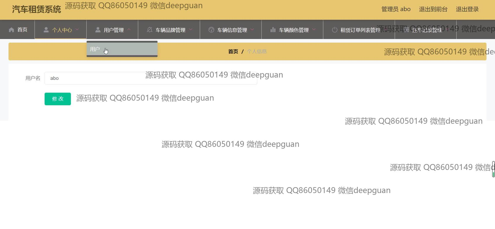

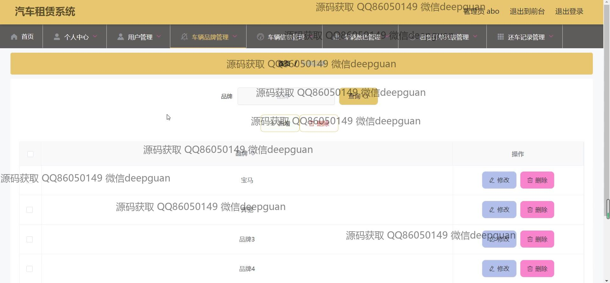
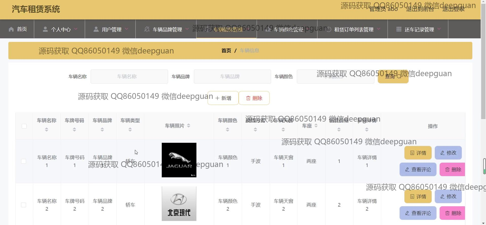
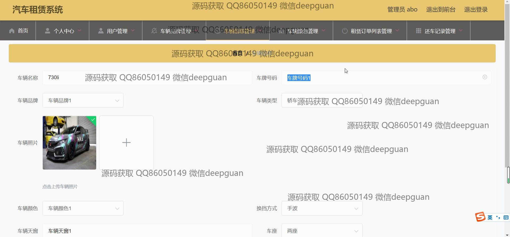

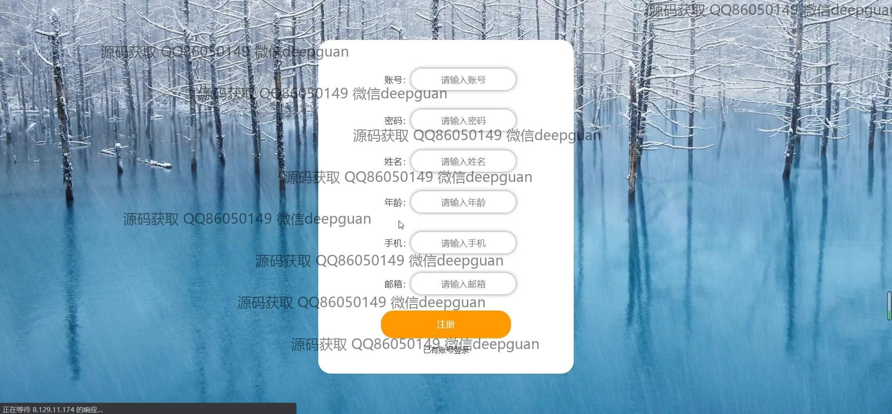
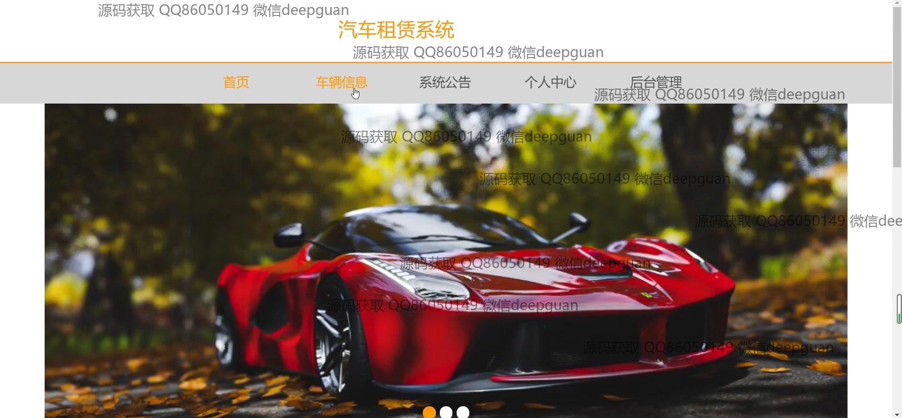
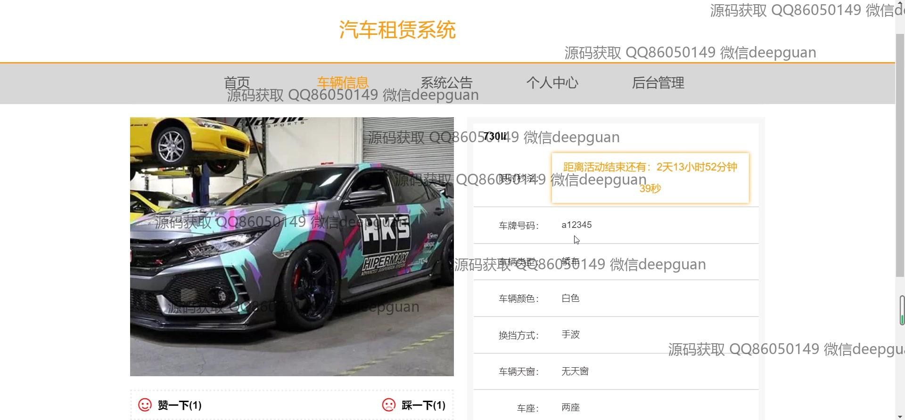
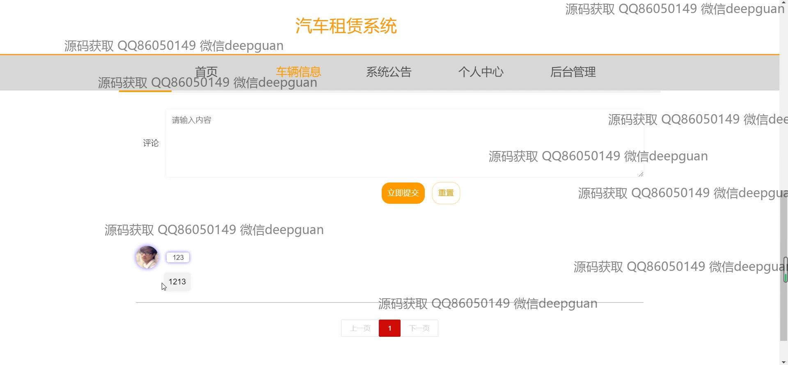
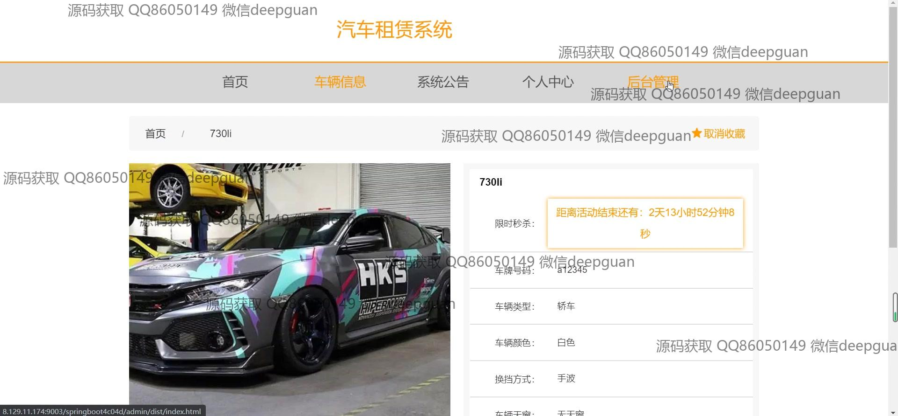
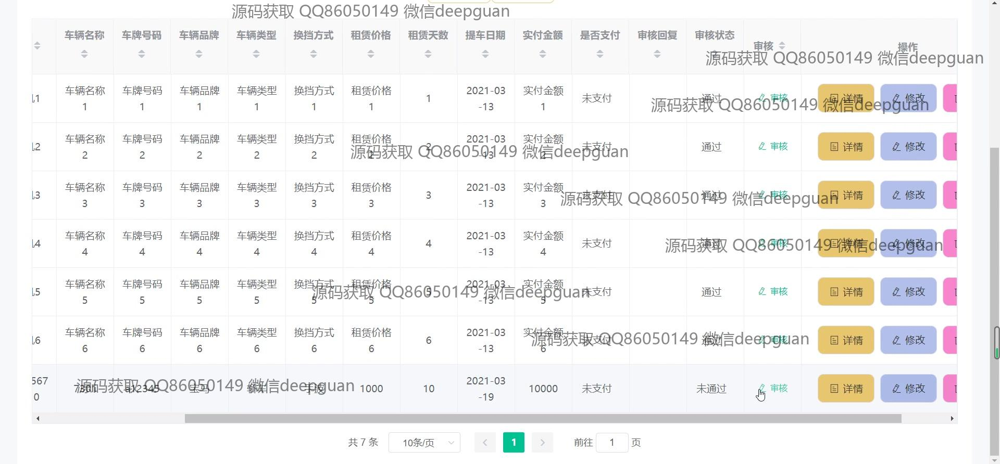
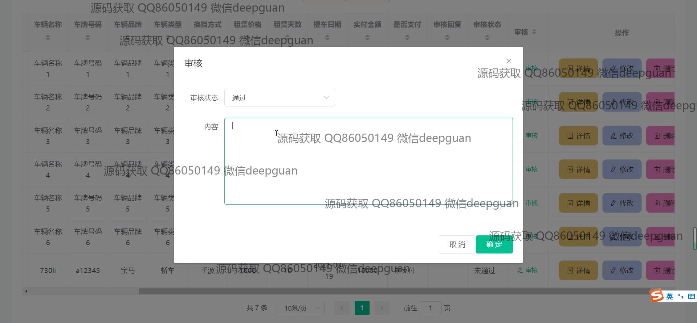

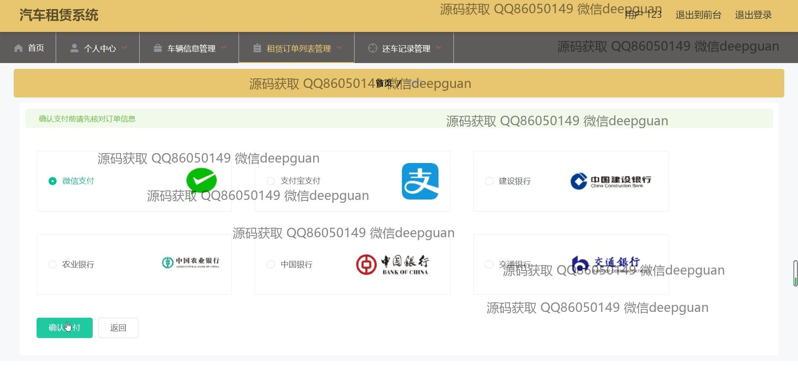
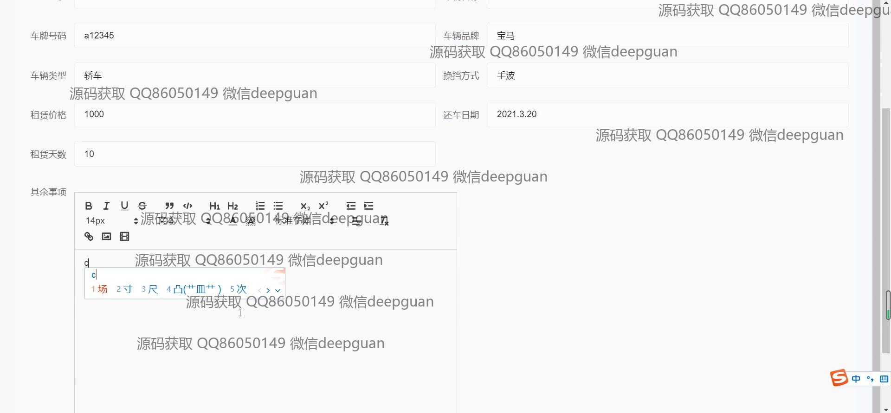
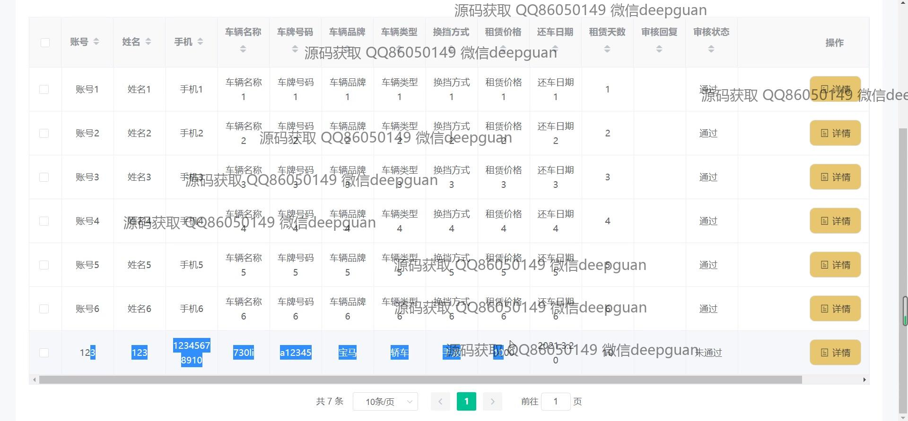
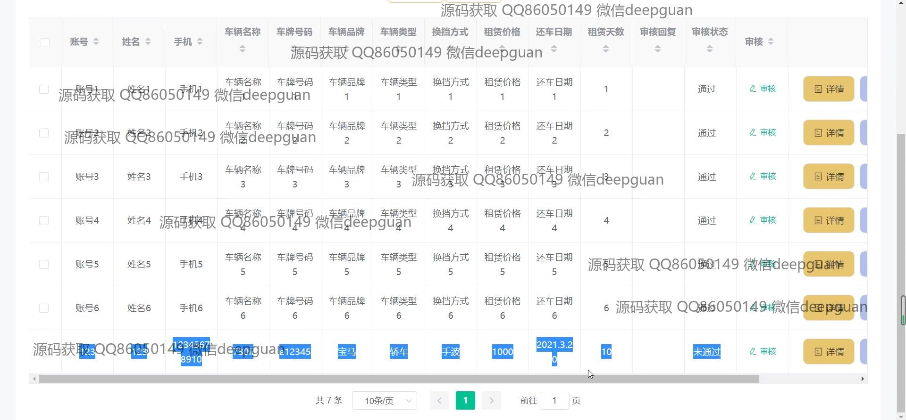
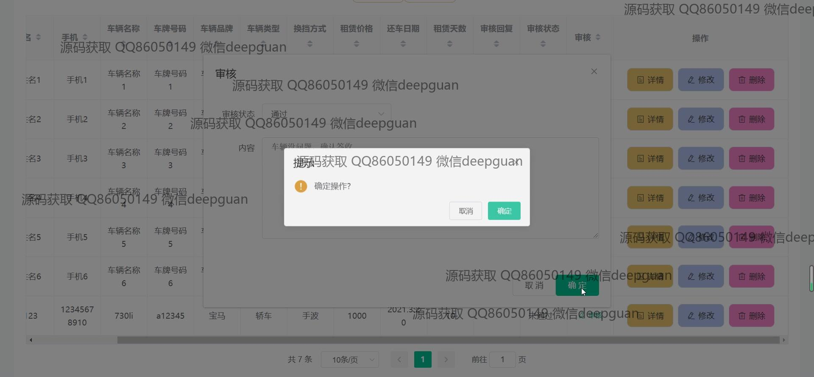
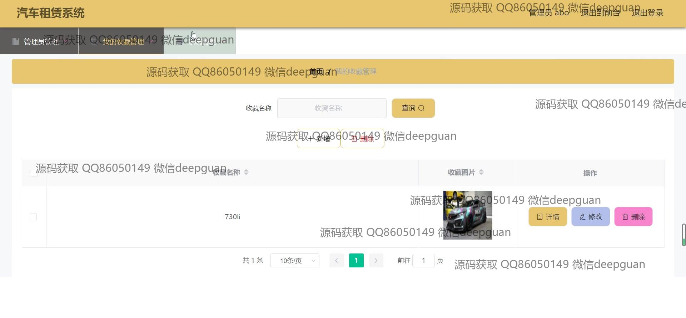
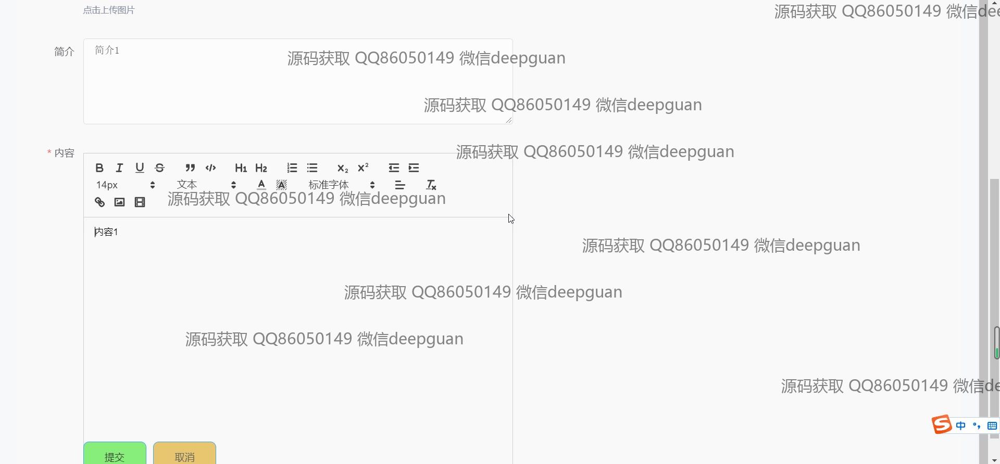
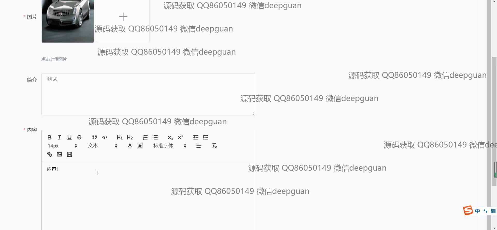
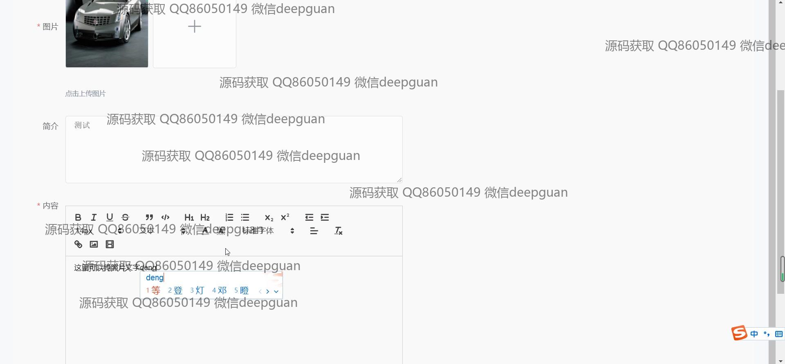
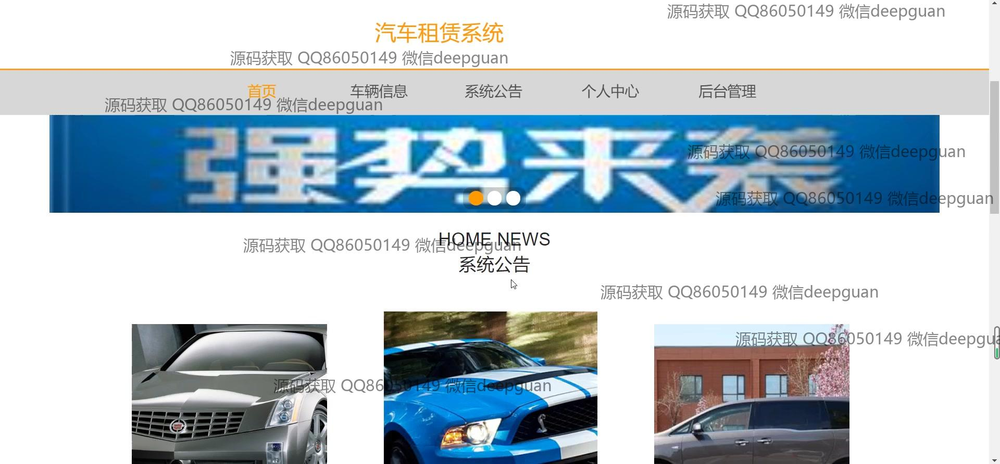

本代码来源于网络,仅供学习参考使用!

